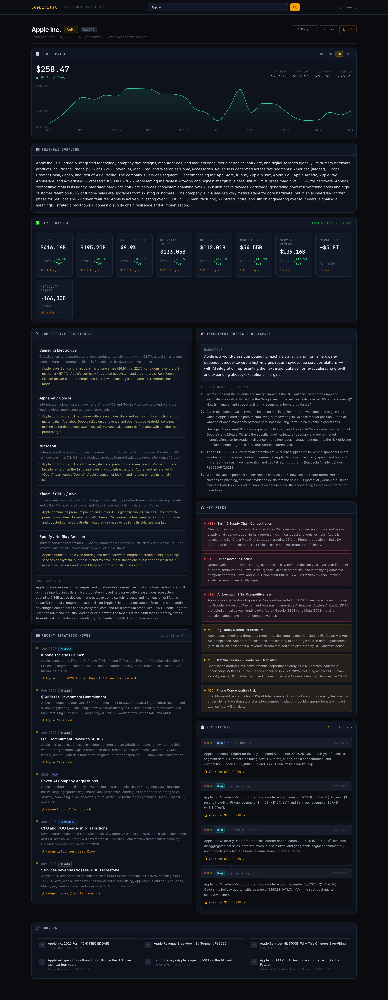

# Due Digital

A full-stack company screening tool for investment analysis. Enter any company name and get a structured memo in under a minute — pulling verified financials directly from SEC EDGAR for public companies, with AI-powered qualitative research for everything else.

> Built as a personal project to explore how LLMs can accelerate early-stage investment diligence.

## Screenshot



---

## What It Does

- **SEC EDGAR integration** — for US-listed public companies, financial metrics (revenue, gross profit, operating income, net income, R&D, EPS) are pulled directly from XBRL filings. Each metric card links to the source filing on sec.gov.
- **AI-powered research** — Claude (`claude-sonnet-4-6`) uses live web search to generate qualitative analysis: business overview, competitive positioning, recent strategic moves, key risks, and diligence questions.
- **Private company support** — falls back to AI-researched financials with source links when no SEC filings exist.
- **Stock price chart** — live price, daily change, 52-week range, and interactive area chart with 1M/3M/6M/1Y range selector (Yahoo Finance).
- **Export** — copy as Markdown, download `.md`, or generate a print-ready PDF memo.

---

## Tech Stack

| Layer | Stack |
|---|---|
| Frontend | React 18, Vite, Tailwind CSS, Recharts |
| Backend | Node.js, Express |
| AI | Anthropic Claude API (`claude-sonnet-4-6`) with `web_search` tool |
| Financial data | SEC EDGAR XBRL API (no key required) |
| Stock data | Yahoo Finance chart API |

---

## Setup

**1. Clone and install dependencies**

```bash
git clone https://github.com/YOUR_USERNAME/due-digital.git
cd due-digital
npm install
cd client && npm install && cd ..
```

**2. Add your Anthropic API key**

```bash
cp .env.example .env
```

Edit `.env` and add your key:

```
ANTHROPIC_API_KEY=sk-ant-...
```

Get a key at [console.anthropic.com](https://console.anthropic.com).

**3. Run**

```bash
npm run dev
```

App runs at `http://localhost:5173`. API server on port `3001`.

---

## How It Works

```
User enters company name
        │
        ├─ Public company? → Fetch financials from SEC EDGAR (free, no key)
        │                     Pass verified data to Claude
        │                     Claude runs 3 web searches (qualitative only)
        │
        └─ Private company? → Claude runs 5 web searches
                              Estimates financials from press releases / news
                              Includes source links on each metric card

Claude calls submit_memo tool → structured JSON response
        │
        ├─ Stock ticker present? → Fetch live price from Yahoo Finance
        │
        └─ Render interactive dashboard
```

Claude's output is structured via a tool call with a defined JSON schema — no text parsing, no regex. The `submit_memo` tool enforces the shape of every response.

---

## Output Sections

| Section | Source |
|---|---|
| Stock Price + Chart | Yahoo Finance (live) |
| Business Overview | Claude + web search |
| Key Financials | SEC EDGAR (public) / AI-estimated (private) |
| Competitive Positioning | Claude + web search |
| Recent Strategic Moves | Claude + web search (last 12 months) |
| Key Risks | Claude + web search |
| SEC Filings | Claude + web search (links to EDGAR) |
| Investment Thesis & Diligence | Claude |
| Sources | Claude (linked URLs) |

---

## Potential Extensions

- **CIM / 10-K upload** — drop in a document and ground the memo in it
- **Side-by-side comparison** — screen two companies simultaneously
- **Memo history** — save past screens with localStorage or SQLite
- **Custom section config** — let analysts choose which sections to generate
- **Comps table** — pull trading multiples for the company and its peers
